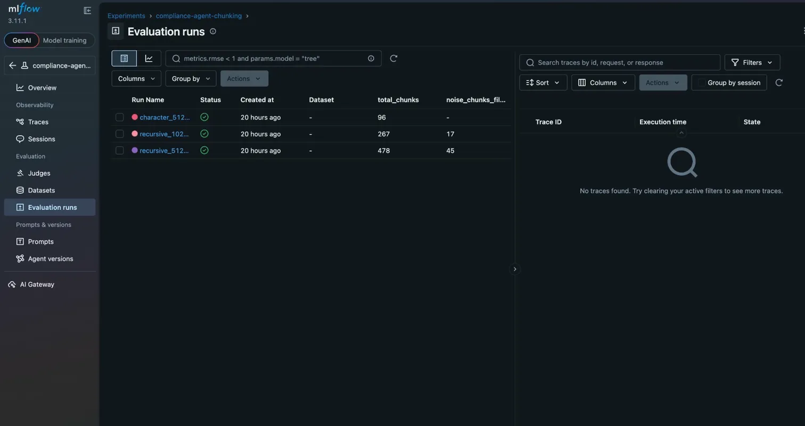
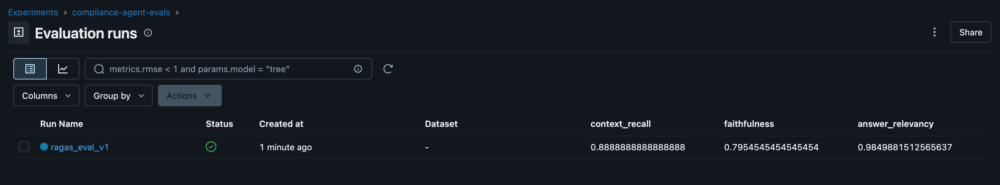

# compliance-agent

An agentic system that ingests a company's internal policy documents and answers
employee questions with cited, auditable responses, flags policy conflicts, and
routes ambiguous queries to a human reviewer.

## Architecture

```
User query
    │
    ▼
┌─────────┐    ┌───────────┐    ┌──────────┐    ┌────────┐
│ Router  │───▶│ Retriever │───▶│ Conflict │───▶│ Critic │
└─────────┘    └───────────┘    └──────────┘    └────────┘
                                      │               │
                                      ▼               ▼
                                 ┌─────────┐     Answer / retry
                                 │  HITL   │
                                 └─────────┘
                                      │
                                      ▼
                               Human reviewer
```

All nodes are wired as a `StateGraph` in `src/agent/graph.py`.  State flows
as a typed dict (`AgentState`) through each node, which returns a partial
update.

## Quick start

```bash
# 1. Clone and install
git clone <repo-url>
cd compliance-agent
python -m venv .venv && source .venv/bin/activate
pip install -r requirements.txt

# 2. Configure secrets
cp .env.example .env
# edit .env — set OPENAI_API_KEY at minimum

# 3. Ingest policy documents
#    Drop PDFs / DOCX files into data/raw/, then:
# python -m src.ingestion   # TODO: add __main__ entrypoint

# 4. Run the API
uvicorn src.api.main:app --reload

# 5. Query the agent
curl -X POST http://localhost:8000/api/v1/query \
     -H "Content-Type: application/json" \
     -d '{"query": "What is the maximum expense claim per diem?"}'
```

## Running tests

```bash
pytest tests/ -v
```

## Evaluation

```bash
# RAGAS metrics
python -m src.evals.ragas_eval

# LLM-judge batch scoring
python -m src.evals.llm_judge
```

## Docker

```bash
docker compose up
```

API available at `http://localhost:8000`, Chroma at `http://localhost:8001`.

## Project structure

| Path | Purpose |
|---|---|
| `src/ingestion/` | PDF/DOCX loading, chunking, Chroma indexing |
| `src/agent/` | LangGraph graph, state schema, nodes |
| `src/evals/` | RAGAS + LLM-judge eval harness |
| `src/api/` | FastAPI routes and Pydantic schemas |
| `tests/` | pytest test suite |
| `notebooks/` | Exploratory Jupyter notebooks |
| `data/raw/` | Raw policy documents (git-ignored) |
| `data/processed/` | Chroma vector index (git-ignored) |

## Architecture Decisions

### Chunking Strategy
After testing on 96 pages of OPM compliance policy documents across three handbooks
(elder care, emergency benefits, dismissal procedures), two decisions were made:

**Recursive over character splitting:**
Character splitting produced 96 chunks — one per page — consistently exceeding the 
token target and failing to split dense policy text meaningfully. Recursive splitting 
produced 478 chunks by trying paragraph, sentence, and word boundaries in order, 
staying within the token budget while preserving semantic coherence.

**Chunk size 1024/128 over 512/64:**
At 512 characters, dense government policy clauses were cut mid-sentence across chunk 
boundaries. For example, a clause defining advance payment calculation limits was split 
across two chunks, making either chunk insufficient to answer a compliance question 
correctly. At 1024/128, complete policy clauses are preserved in single chunks. The 
higher token cost per retrieval is an acceptable tradeoff for answer reliability in a 
compliance context where incomplete rules can produce harmful answers.

**Noise filtering:**
Chunks under 100 characters are dropped at index time. Cover pages, table of contents 
entries, and section headers were being indexed and polluting retrieval results.


## Known limitations

- TOC detection uses dot-pattern heuristics — may miss TOCs without 
  dot leaders. Future fix: section-aware splitting with Docling.
- Critic score is a single float — does not distinguish between 
  faithfulness and completeness failures separately.
- Conflict node not yet implemented — queries classified as `conflict` 
  will not return meaningful answers.
- No persistent conversation memory across sessions.

**Experiment tracking:** Used MLflow to log all chunking experiments. 
Three strategies compared across 96 pages of OPM compliance documents.
Results available in MLflow UI. Final selection: recursive_1024_128 
based on chunk coherence and policy clause completeness.


**Agent State**:
query          → what the user asked. Set at the start, never changes.
routed_to      → router writes this. "retriever", "conflict", or "hitl"
retrieved_docs → retriever writes this. The K=6 chunks from Chroma
conflicts      → conflict node writes this. List of contradictions found
answer         → retriever/conflict node writes a draft answer here
critique       → critic node writes its assessment statement here
critique_score → critic score writes its assessment score here
needs_hitl     → critic or router sets this True to escalate to human
hitl_response  → populated externally when human reviewer responds
messages       → full conversation history, managed by LangGraph

### Agent nodes

**Router node:**
Uses GPT-4o-mini at temperature=0 to classify queries into three categories:
`retriever` (factual), `conflict` (policy comparison), or `hitl` (ambiguous).
Temperature=0 ensures deterministic routing — same query always takes the same path.
Invalid LLM responses default to `hitl` as a safe fallback.

**Retriever node:**
Runs a similarity search against the Chroma vector store (K=6) and passes
retrieved chunks to GPT-4o-mini for answer synthesis. Initial implementation
returned raw chunks as the answer and scored 0.4 on critic evaluation.
Adding an LLM synthesis step that generates a cited answer from the chunks
brought critic scores to 1.0. The critic loop caught this gap before
manual testing would have.

**Critic node:**
Evaluates answer faithfulness, completeness, and citation quality on a 0.0-1.0
scale using GPT-4o-mini at temperature=0. Answers scoring below 0.7 trigger
a retrieval retry. After 2 failed retries the system escalates to human review
rather than returning a low-quality answer. Parse failures default to 0.0 to
err on the side of caution.

**LangGraph state machine:**
Five-node graph with two conditional edges — one after the router (routing
decision) and one after the critic (retry, escalate, or end). The graph
handles retry loops and branching natively, eliminating the need for manual
flow control code.

**Conflict node:**
Uses K=8 retrieval (vs K=6 for standard retrieval) to cast a wider net 
across documents. Tested with cross-document query about telework policies —
correctly identified contradictions between elder care flexibility provisions
and emergency leave continuity requirements, with page-level citations from
both source documents.

## End-to-end test results

| Query type | Route | Critic score | Result |
|------------|-------|--------------|--------|
| "What happens to my pay during a weather emergency?" | retriever | 1.0 | Cited answer, pages 2-4 |
| "How do elder care and emergency leave differ on telework?" | conflict | 1.0 | Cross-document conflict analysis |
| "I have a complicated situation with my leave" | hitl | — | Paused for human review |


## Evaluation results (v1)

| Metric | Score |
|--------|-------|
| Faithfulness | 0.84 |
| Answer relevancy | 0.98 |
| Context recall | 0.89 |

Evaluated against 6 golden test cases covering factual queries across 
3 OPM policy documents and 1 cross-document conflict query.
Faithfulness gap (0.16) attributed to conflict analysis node drawing 
implicit conclusions not explicitly stated in source chunks — a known 
tradeoff in cross-document reasoning tasks.

Another Run after adding MlFlow Tracking 


- Conflict analysis returned as prose in `answer` field rather than 
  structured `ConflictSummary` objects. Future improvement for 
  frontend rendering.

## API

### POST /api/v1/query
```json
// request
{"query": "What happens to my pay during a weather emergency?"}

// response
{"answer":"During a weather emergency, if your official Federal worksite is closed, your agency may provide weather and safety leave at its discretion. This leave does not have specific time limitations and should align with the nature of the emergency. If you are on weather and safety leave, you will continue to receive your regular pay based on the rates and allowances you were entitled to before the emergency [emergencybenefits.pdf, pages 2-4]. \n\nIf you are required to evacuate, your agency may authorize evacuation payments, which will cover the period of evacuation and be based on your regular pay [emergencybenefits.pdf, pages 3-4].",
"citations":[{"source":"emergencybenefits.pdf","page":2},{"source":"emergencybenefits.pdf","page":3},{"source":"emergencybenefits.pdf","page":4}],
"needs_hitl":false,
"critique_score":1.0,
"thread_id":null}
```

### GET /api/v1/health
```json
{"status": "ok"}
```
## API endpoints

| Method | Endpoint | Description |
|--------|----------|-------------|
| GET | `/api/v1/health` | Health check |
| POST | `/api/v1/query` | Submit a compliance question |
| POST | `/api/v1/hitl/respond` | Resume a human-reviewed query |

## Running locally

```bash
# install dependencies
python -m venv venv
source venv/bin/activate
pip install -r requirements.txt

# set up environment
cp .env.example .env
# add your OPENAI_API_KEY to .env

# run the API
uvicorn src.api.main:app --reload --port 8000
```

## Running with Docker

```bash
docker build -t compliance-agent:latest .
docker run -p 8000:8000 --env-file .env -v $(pwd)/data:/app/data compliance-agent:latest
```

## CI/CD

GitHub Actions runs on every push to `main`:
1. Ruff lint and format check
2. Pytest unit tests
3. Docker build verification